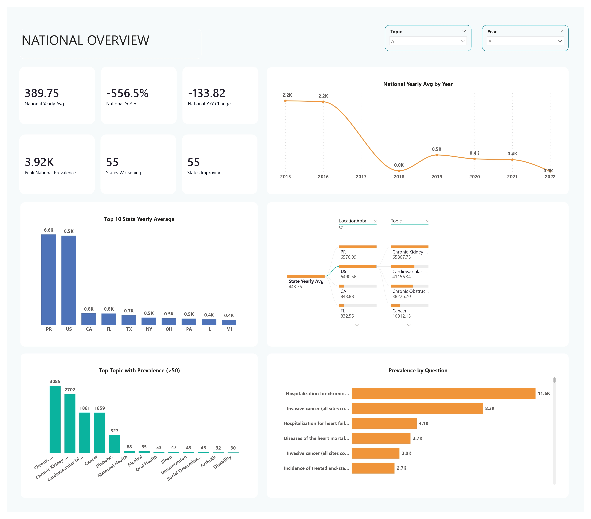
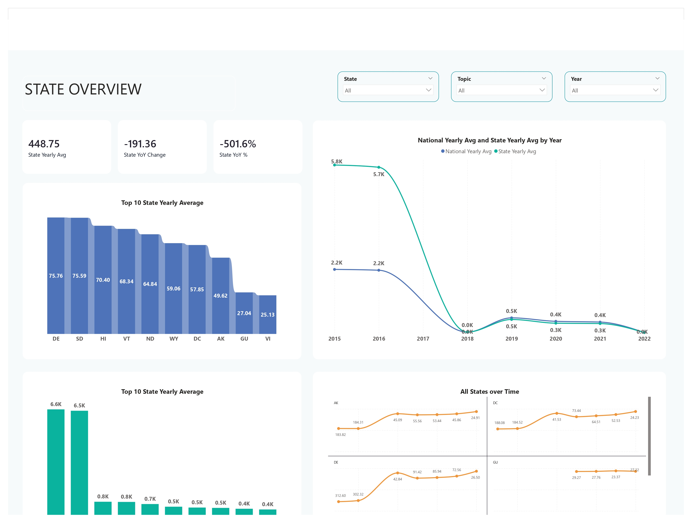
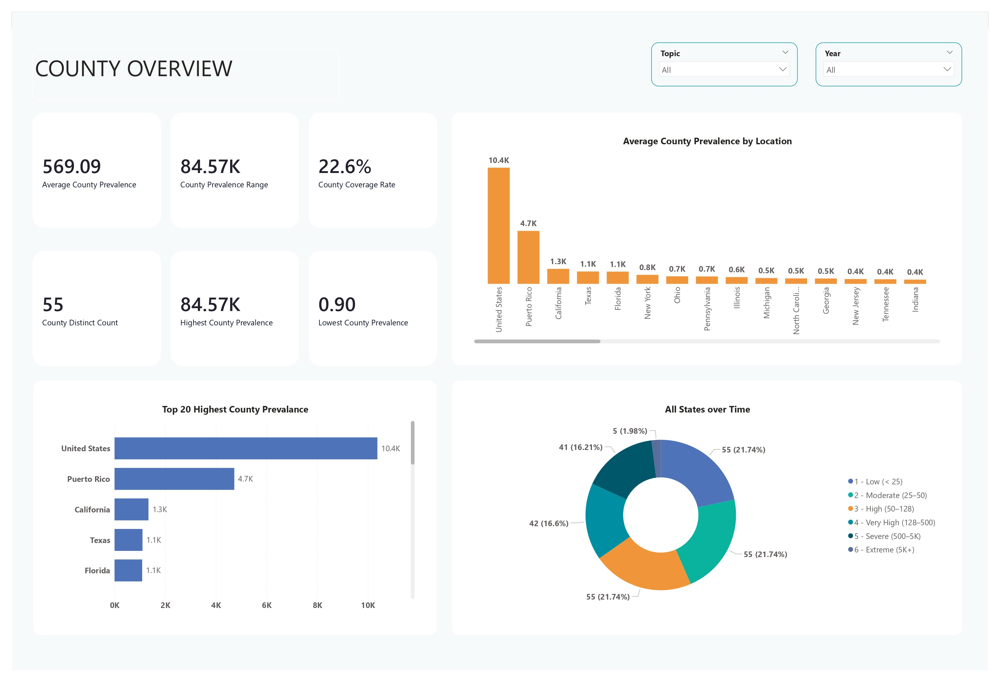
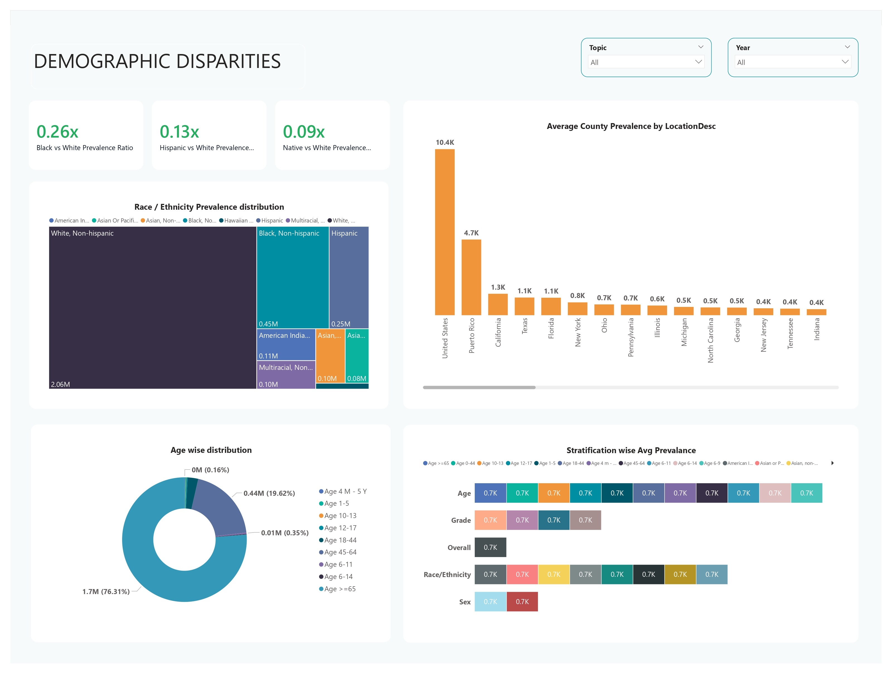

# US Chronic Disease Analysis using Spark and Power BI

A comprehensive data analysis project leveraging Apache Spark for ETL and data processing of US chronic disease indicators, with visualization and reporting through Power BI.

## Overview

This project processes raw US Chronic Disease Indicators data using PySpark to create clean, aggregated datasets (gold layer) suitable for analysis and visualization. The pipeline includes data quality assessments, trend analysis over time, and structured dimensions and facts for business intelligence.

### Overview Dashboard

The following dashboard screenshots illustrate different views of the project data:










## Project Structure

```
├── README.md                          # Project documentation
├── requirements.txt                   # Python dependencies
├── data/
│   ├── raw/
│   │   └── US_Chronic_Disease_Indicators.csv    # Raw source data
│   ├── gold_temp/                              # staging area for intermediate output
│   │   └── _SUCCESS etc.
│   └── gold/                                   # final processed data (Parquet)
│       ├── data_quality_report.parquet         # Data quality metrics
│       ├── quality_disparities_report.parquet  # Disparity-specific QA
│       ├── quality_risk_join_report.parquet    # Risk factor QA
│       ├── risk_condition_correlation.parquet  # Analysis output
│       ├── dim_location.parquet                # Location dimension table
│       ├── dim_stratification.parquet          # Stratification dimension table
│       ├── dim_topic.parquet                   # Disease topic dimension table
│       ├── dim_demographic.parquet             # Demographic dimension
│       ├── dim_year.parquet                    # Year dimension table
│       ├── fact_chronic_disease.parquet        # Main fact table
│       ├── fact_county_prevalance.parquet      # County-level prevalence facts
│       ├── fact_state_trends.parquet           # State-level trend facts
│       ├── fact_national_trends.parquet        # National trend facts
│       ├── fact_disparities_pivot.parquet      # Pivoted disparities analysis
│       ├── fact_risk_condition_pairs.parquet   # Risk factor pairings
└── src/
    ├── config.py                     # Configuration and path settings
    ├── main.py                       # Main ETL pipeline entry point
    ├── helper/
    │   └── parquet_save_helper.py    # Utility functions for saving Parquet files
    └── jobs/
        ├── task1_overview.py         # Overview/aggregation analysis
        ├── task2_trends_over_time.py # Temporal trend analysis
        ├── task3_disparities.py      # Disparities and equity analysis
        └── task4_risk_factor.py      # Risk factor correlation reporting
```

## Data Model

### Dimension Tables
- **dim_location**: Geographic information (counties, states)
- **dim_stratification**: Demographic stratification (age, gender, race, etc.)
- **dim_topic**: Disease categories and health indicators
- **dim_demographic**: Additional demographic attributes and categories
- **dim_year**: Calendar year lookup table used for time analysis

### Fact Tables
- **fact_chronic_disease**: Core fact table with measurements and indicators
- **fact_county_prevalance**: County-level prevalence data
- **fact_national_trends**: Aggregated national-level trends
- **fact_state_trends**: State-level trend analysis
- **fact_disparities_pivot**: Pivoted facts for disparity/equity dashboards
- **fact_risk_condition_pairs**: Risk factor and condition pairing analysis

### Quality Assurance & Reports
- **data_quality_report.parquet**: General data validation and quality metrics
- **quality_disparities_report.parquet**: QA metrics specific to disparity calculations
- **quality_risk_join_report.parquet**: Quality checks for risk-factor joins
- **risk_condition_correlation.parquet**: Analytical output showing correlation between risk factors and conditions

> All gold‑layer datasets are written as Parquet files for efficient downstream consumption.

## Getting Started

### Prerequisites
- Python 3.7+
- Apache Spark
- Dependencies listed in `requirements.txt`

### Installation

1. Clone or download the repository
2. Install dependencies:
   ```bash
   pip install -r requirements.txt
   ```

3. Ensure Apache Spark is properly configured in your environment

### Running the Pipeline

Execute the main ETL pipeline:

```
spark-submit src/main.py
```

This will:
1. Load raw US Chronic Disease Indicators data
2. Run overview analysis (Task 1)
3. Run trend analysis over time (Task 2)
4. Output processed data to the gold layer

## Key Components

### Configuration (`src/config.py`)
- Defines file paths for raw and processed data
- Contains Spark configuration settings
- Sets application name and logging preferences

### Main Pipeline (`src/main.py`)
- Initializes Spark session
- Loads raw CSV data
- Orchestrates task execution across jobs
- Manages Spark lifecycle and writes to gold layer

### Task 1: Overview Analysis (`src/jobs/task1_overview.py`)
- Generates summary statistics and basic aggregations
- Creates dimension tables and the core fact table

### Task 2: Trends Over Time (`src/jobs/task2_trends_over_time.py`)
- Analyzes temporal patterns in disease indicators
- Identifies national and state-level trends
- Produces time-series fact tables for trends

### Task 3: Disparities Analysis (`src/jobs/task3_disparities.py`)
- Examines demographic disparities in disease prevalence
- Generates pivoted facts for equity dashboards

### Task 4: Risk Factor Correlation (`src/jobs/task4_risk_factor.py`)
- Correlates risk factors with chronic conditions
- Produces risk–condition pairing reports

### Helper Functions (`src/helper/parquet_save_helper.py`)
- Utilities for writing Spark DataFrames to Parquet format
- Ensures consistent save options and directory handling

## Output

All processed data is written to the `data/gold/` directory in CSV format, ready for:
- Power BI visualization and reporting
- Further analysis and exploration
- Data archival and documentation

## Power BI Integration

The gold layer data is designed for direct import into Power BI:
- Use dimension tables for slicing and filtering
- Build measures from fact table data
- Create relationships using key fields
- Design interactive dashboards and reports


